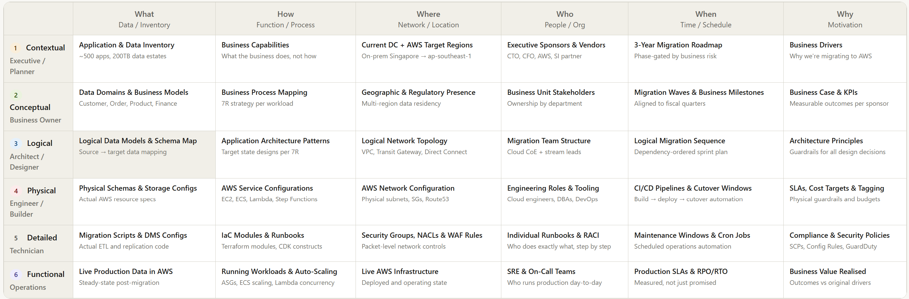
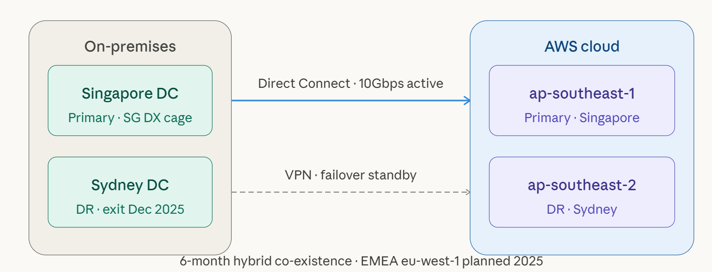
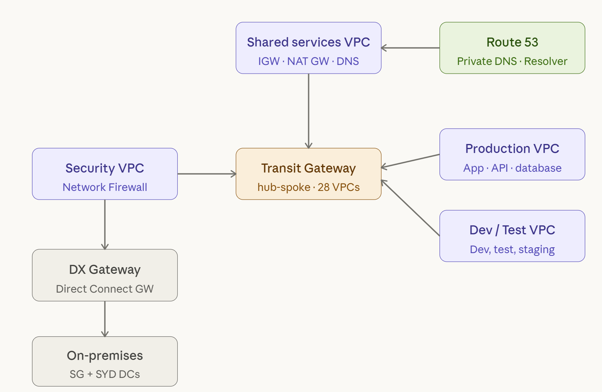
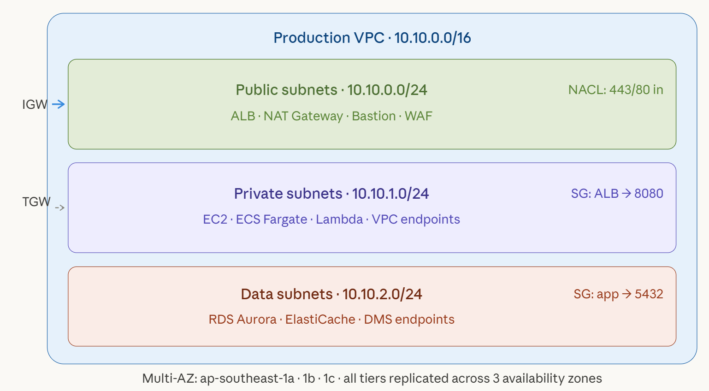

# AWS Migration Overview with Zachman Framework & Best Practices

<!-- toc-start -->

<!-- toc-end -->

## The Zachman Framework

The Zachman Framework is an enterprise architecture framework created by John Zachman in 1987. It's essentially a **two-dimensional classification schema** for organizing architectural artifacts of an enterprise — think of it as a structured way to describe any complex system from multiple perspectives.

---

### The Grid: Two Axes

**Columns — The "Interrogatives" (What, How, Where, Who, When, Why)**

These represent the fundamental questions you can ask about any system:

| Column | Interrogative | Concern |
|--------|--------------|---------|
| 1 | **What** | Data / Inventory |
| 2 | **How** | Function / Process |
| 3 | **Where** | Network / Location |
| 4 | **Who** | People / Organization |
| 5 | **When** | Time / Schedule |
| 6 | **Why** | Motivation / Strategy |

**Rows — The "Perspectives" (Stakeholder viewpoints)**

| Row | Perspective | Audience |
|-----|-------------|----------|
| 1 | **Contextual** (Scope) | Executive / Planner |
| 2 | **Conceptual** (Business) | Business Owner |
| 3 | **Logical** (System) | Architect / Designer |
| 4 | **Physical** (Technology) | Engineer / Builder |
| 5 | **Detailed** (Component) | Technician / Subcontractor |
| 6 | **Functional** (Operations) | Enterprise itself |

This produces a **6×6 matrix of 36 cells**, each containing a distinct architectural artifact (e.g., an ER diagram, a process flow, a network diagram).

---

### Key Principles

- **Each cell is unique** — no two cells contain the same type of artifact
- **Rows are independent** — each perspective is complete on its own terms, without reference to another row
- **Columns are consistent** — the same fundamental question is answered at every level of abstraction
- **It's descriptive, not prescriptive** — Zachman doesn't tell you *how* to build, only *what* to describe

---

### Practical Relevance

In your world of **distributed data systems and pipelines**, the Zachman lens maps naturally:

- **What (Row 3–4)**: Logical data models → physical Delta Lake schemas, table formats
- **How (Row 3–4)**: Logical process flows → Databricks job DAGs, DLT pipelines
- **Where (Row 3–4)**: Logical topology → physical multi-region cloud deployment, Kafka cluster placement
- **When (Row 3–4)**: Scheduling logic → streaming trigger intervals, checkpointing cadence
- **Why (Row 1–2)**: Business drivers → SLAs for streaming ingest, RTO/RPO targets for DR

---

### Criticisms

- **Completeness is overwhelming** — filling all 36 cells for a large enterprise is enormously labor-intensive
- **Not a methodology** — it tells you *what* to document, not *how* to do architecture
- **Can become a bureaucratic exercise** rather than driving real design decisions
- Often more useful as a **communication and audit tool** than a design driver

It remains influential in EA circles (TOGAF, DoDAF often reference it), but in practice most teams use a subset of cells relevant to their context rather than the full matrix.

## Architecture perspective of a AWS Migration project with Zachman framework

**Click on the link below to have a interactive view**:

[Zachman Framework matrix for AWS Migration](https://ckp-aws.github.io/aws-enterprise-cloud-architecture.github.io/aws-migration-overview-with-zachman-framework.html "Zachman Framework matrix for AWS Migration")

Each of the 36 cells is clickable and contains the actual artifacts, tools, and decisions relevant to that intersection. Here's how to read the framework in the context of your migration:

**Reading across a row** gives you a complete view from one stakeholder's perspective. The Executive row (Row 1) stays intentionally abstract — business drivers, timeline phases, and DC exit goals. The Physical row (Row 4) is where AWS service names, instance families, and CIDR blocks live.

**Reading down a column** shows how an interrogative cascades from intent to reality. The "Why" column traces from business drivers → architecture principles → SLAs → compliance SCPs → realized ROI. This is where governance gaps tend to appear: when Row 1's "why" and Row 5's "why" tell different stories.

**High-value cells for a migration project:**

- **Logical × How** (Row 3, Col 2) — the 7R classification per workload is where most migration architecture debate happens. Rehost vs replatform vs refactor decisions cascade into cost, timeline, and risk.
- **Physical × Where** (Row 4, Col 3) — CIDR design, TGW topology, and DNS cutover strategy. Mistakes here are the hardest to remediate post-migration.
- **Detailed × Why** (Row 5, Col 6) — SCPs and Config Rules are the enforceable expression of your governance intent. If these don't match Row 1's compliance drivers, you have a paper policy.
- **Functional × When** (Row 6, Col 5) — where your RPO/RTO commitments meet the real world. This cell is the ultimate test of everything above it.

# Complete logical network architecture

The network architecture cuts across all six Zachman rows — from the executive's two-sentence connectivity statement all the way down to CIDR blocks and NACLs. Here it is as three sequential diagrams, each zooming in one level.

**Row 1–2: Geographic scope** — where the DCs are, what the AWS target regions are, and how they connect at a business level.

Image: **Geographic Connectivity**

**Row 3: Logical VPC topology** — this is where design decisions live. The hub-and-spoke model with Transit Gateway as the central routing plane, four purpose-built VPCs, the Direct Connect Gateway chain down to on-prem, and Route 53 Resolver hanging off Shared Services as the DNS authority for all private hosted zones.

**Rows 4–5: Physical subnet architecture** — this is the inside of a single production VPC. Three horizontal tiers, each with its own CIDR block, security controls, and service placement. Every prod VPC in the Landing Zone follows this same pattern across all three AZs.Reading down the "Where" column, a few design decisions compound across rows in ways worth calling out:

The **Direct Connect + VPN pair** (Diagram 1) is not just redundancy — it's a deliberate BGP design. DX carries primary traffic with AS path prepending favouring ap-southeast-1. VPN uses the same BGP session but with longer AS paths, so it only wins if DX drops. This gets tested explicitly during each wave's DR drill.

The **Security VPC as a mandatory choke point** (Diagram 2) is the most contentious decision in this topology. All east-west traffic between Prod, Dev, and Shared Services transits through it via TGW route tables, not through direct VPC attachments. This adds ~1ms of latency but gives the Security team a single enforcement plane for Network Firewall rules across all 42 accounts — the alternative (per-VPC security groups only) was rejected at the Architecture Board.

The **three-tier subnet pattern** (Diagram 3) is enforced at the Landing Zone level via Service Control Policies. No team can provision an RDS instance in a public subnet — the SCP denies `rds:CreateDBInstance` unless the subnet has the tag `tier=data`. The `SG: app → 5432` annotation in the data tier isn't advisory; it's the only inbound rule allowed — an AWS Config rule flags any data-tier SG that opens port 5432 to anything other than the app SG ID.

### What is the DR and decommission plan for a DC?

As per the **Geographic Connectivity** image above, here's the consolidated picture across all six perspectives for one of the DC, here Sydney DC specifically.

**What Sydney is today (Contextual)**

Sydney DC is the existing DR site for the Singapore primary DC. It runs a subset of Tier 1 workloads in warm standby — not active-active, but with RPO of a few hours via replication. The plan is full exit by December 2025, mirroring the Singapore DC exit timeline.

**The migration sequencing logic (Conceptual)**

Sydney isn't migrated in isolation — it follows Singapore. The wave structure is:
- Waves 1–4 migrate workloads from Singapore DC to ap-southeast-1 (primary AWS region)
- As each Singapore workload is migrated and validated on AWS, the Sydney DR copy of that workload is decommissioned — not migrated separately
- ap-southeast-2 (Sydney AWS region) becomes the new DR target, replacing the physical Sydney DC

This means Sydney DC decommissioning is a byproduct of Singapore migration completion, not a parallel workstream.

**AWS DR architecture replacing Sydney DC (Logical)**

The Sydney DC's DR role is taken over by ap-southeast-2 with three mechanisms:

- Aurora Global Database with a read replica in ap-southeast-2 — sub-second replication lag, promotes to primary in under a minute for Tier 1 databases
- S3 Cross-Region Replication from ap-southeast-1 buckets to ap-southeast-2, continuous with replication time control (RTC) for PCI-scoped data
- Route 53 health checks with failover routing — if the ap-southeast-1 ALB health check fails, DNS automatically resolves to ap-southeast-2 endpoints

RTO for Tier 1 on AWS DR is under 4 hours (tested), versus the Sydney DC warm standby which was never formally RTO-tested.

**Physical decommission steps (Physical/Detailed)**

Each Sydney DC rack follows this sequence after its workload exits:

1. Confirm zero active connections via network flow logs — 30-day observation window
2. Power down non-critical services first, then standby databases
3. AWS DMS replication tasks terminated, DX cross-connect to Sydney cage cancelled
4. Hardware vendor notified for asset retrieval or disposal (ITAD vendor with data destruction certificates)
5. Colocation contract termination — 90-day notice clause in the colo agreement
6. Final audit: CloudTrail confirms no API calls originating from Sydney DC IP ranges

**The co-existence risk period**

The 6-month hybrid window is the highest-risk phase for Sydney specifically. During this period both Sydney DC and ap-southeast-2 hold live replicas of Tier 1 data. The risk is split-brain — a failover triggered during this window could land on either target. The mitigation is a hard operational rule: during the hybrid window, Sydney DC failover is manually gated via a ServiceNow change request, while ap-southeast-2 failover is automated. This forces any DR invocation to make a conscious choice about which target to use.

**What remains in Sydney post-exit**

Nothing persistent. The only planned aws presence in ap-southeast-2 post-migration is the DR replica tier — no active workloads run there in steady state. This is a cost decision: running full active-active across two AWS regions roughly doubles compute spend. The architecture board accepted the RTO/RPO trade-off of a warm DR replica over active-active given the workload's actual availability requirements.

### How are Transit Gateway route tables configured to isolate prod from dev in this migration?

This is one of the more nuanced TGW design decisions in a Landing Zone deployment. The isolation model uses **separate route tables per environment**, not a single shared route table — here's exactly how it works.

#### The core principle: route table per domain, not per VPC

A Transit Gateway has its own routing plane that's completely separate from VPC route tables. Each TGW attachment (VPC or DX Gateway) is associated with exactly one TGW route table, and can propagate its CIDR into one or more route tables. You exploit this asymmetry to create one-way or zero-way visibility between environments.

#### The three route tables

**Production route table**
- Associated attachments: Prod VPC, Shared Services VPC, DX Gateway (on-prem)
- Routes propagated into it: Prod VPC CIDR, Shared Services CIDR, on-prem summary routes
- Dev VPC is never propagated here — Prod literally has no route to Dev's CIDR

**Non-production route table**
- Associated attachments: Dev VPC, Test VPC, Staging VPC
- Routes propagated into it: Dev/Test/Staging CIDRs, Shared Services CIDR, on-prem summary routes (for build servers, artifact repos)
- Prod VPC CIDR is absent — Dev cannot reach Prod at the network layer at all

**Shared Services route table**
- Associated attachments: Shared Services VPC only
- Routes propagated into it: all CIDRs — Prod, Dev, Test, on-prem
- This is what allows Shared Services to act as the hub: it can reach everyone, but that reachability is not symmetric

#### What "associated" vs "propagated" actually means

These two concepts are the crux of TGW isolation:

- **Association** determines which route table governs outbound traffic *from* an attachment. A VPC attachment associated with the Prod route table means: when traffic leaves the Prod VPC into the TGW, the TGW looks up the destination in the Prod route table.
- **Propagation** determines which route tables a VPC's CIDR block is *advertised into*. The Dev VPC propagates its CIDR into the Non-Prod route table and the Shared Services route table — but not into the Prod route table. So even if someone in Prod tries to send a packet to a Dev IP, the TGW drops it: no matching route.

The combination of the two is what creates the asymmetric isolation. Dev can reach Shared Services. Shared Services can reach Prod. But Dev cannot reach Prod, and Prod cannot reach Dev — because neither has the other's CIDR in its associated route table.

#### Blackhole routes as an explicit safety net

On top of the propagation design, explicit blackhole routes are added to each route table for CIDRs that must never be reachable. For example, the Prod route table has a static blackhole for the entire `10.10.8.0/22` dev/test supernet. This matters because propagation controls can drift — a misconfigured attachment, a new VPC peering accidentally added — but a static blackhole route always wins over a propagated route (static > propagated in TGW route priority). It's a belt-and-suspenders enforcement.

#### How the Security VPC fits in

The Security VPC (running AWS Network Firewall) sits between all VPCs and the internet, and also intercepts east-west traffic between Prod and Shared Services. Its TGW route table has a default route pointing at the Network Firewall endpoint. This means even traffic that is *allowed* by the TGW route tables still passes through stateful inspection before it reaches its destination — the TGW isolation is a routing-layer control, and Network Firewall is the packet-inspection layer on top.

#### Enforcement beyond TGW routing

TGW route tables prevent lateral movement at the routing plane, but three additional controls reinforce this in the migration:

An **SCP** denies VPC peering creation between accounts tagged `env=prod` and accounts tagged `env=dev` — this prevents engineers from accidentally bypassing TGW isolation by creating a direct peering.

**AWS Config rules** continuously evaluate whether any TGW route table has a route to a CIDR that violates the isolation policy. A finding auto-opens a Jira ticket and alerts the Security team.

**Security group rules** in the Prod VPC never reference Dev security group IDs as sources — so even if someone somehow punched a routing hole, the instance-level SG would reject the connection.

The TGW route table design is the primary control, but the SCP and Config rules are what give the Architecture Board confidence that the isolation won't be accidentally dismantled six months after go-live when institutional memory has faded.

### What NACL and security group rules protect the public subnet tier?

This is covered in the detail panel of the `physical_subnet_tiers` artifact — click the green public subnets tier to expand it. Here's the full breakdown from that cell:

**NACLs (stateless, subnet boundary)**

Inbound allows 443 and 80 from `0.0.0.0/0` — everything else is denied at the boundary before it even reaches a security group. Outbound allows ephemeral ports 1024–65535 back to the private subnets (required for return traffic since NACLs are stateless), with a deny for any cross-environment CIDRs so public subnet resources can't accidentally initiate traffic toward dev or test ranges.

**Security groups (stateful, instance/service boundary)**

The public tier runs no EC2 instances — only managed services (ALB, NAT Gateway, Bastion). So the security group model here is:

- ALB security group: inbound 443/80 from `0.0.0.0/0`, outbound port 8080 to the App SG in the private tier only. No other outbound.
- NAT Gateway: managed by AWS, no SG attached — NACL is the only control.
- Bastion: inbound port 22 locked to the corporate IP range (or ideally removed entirely in favour of SSM Session Manager, which requires no open inbound port at all).

**The layering logic**

NACLs act as a coarse perimeter — they drop traffic that should never reach the subnet regardless of what services are running inside it. Security groups are the fine-grained per-service control. Because NACLs are stateless, the ephemeral port outbound rule is easy to forget and causes hard-to-diagnose connectivity failures; the Config rule in the Landing Zone checks that this return-traffic rule is always present on the public tier NACL.

The most important design choice here is the absence of any compute in the public tier. Keeping it to ALB + NAT + Bastion means the SG attack surface is minimal — the ALB SG is the only one that accepts public internet traffic, and its only outbound permission is a single port to a specific SG ID in the private tier.
